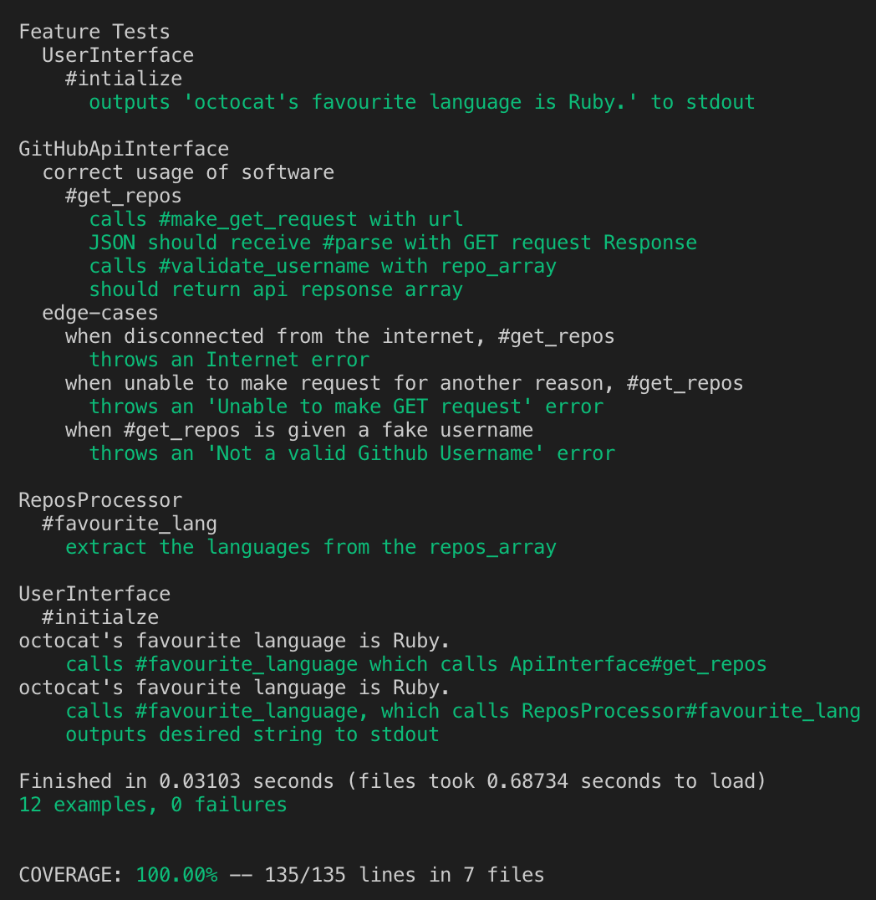
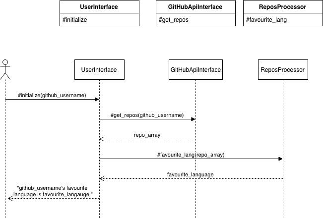

# GitHub API Favourite Language

```
As a User,
So estimate someone favourite language,
I want to see their most frequently used language on GitHub.
```
## My Approach

I BDD'ed this project.

`User Story --> Feature Test --> Unit Test --> Red --> Green --> Refactor --> Repeat`

## Tech

Built with

* Language      : Ruby
* Testing       : RSpec (Unit and Feature)
* Linter        : RuboCop
* Code Coverage : SimpleCov 

## Usage

1. Clone this repo to your local machine.
```
git clone https://github.com/JonathanAndrews/bank_tech_test.git
```
2. `cd` into the project.
2. `bundle install` to install all the dependencies.
2. `rspec` to run the tests.
2. The tests should look like this.



6. There are two ways to use the software:
* Straight from the command line
* IRB

## Command Line Demo
```
ruby whats_their_favourite_langauge.rb octocat JonathanAndrews zaargy

octocat's favourite language is Ruby.
JonathanAndrews's favourite language is Ruby.
zaargy's favourite language is Ruby.

```

## IRB Demo
```
irb -r './lib/user_interface.rb'

2.5.1 :001 > UserInterface.new('octocat')

octocat's favourite language is Ruby.
```
Edge cases demonstrated below:
```
2.5.1 :002 > UserInterface.new('not_a_real_username')

RuntimeError (Not a valid Github Username)

2.5.1 :003 > UserInterface.new('octocat')

RuntimeError (Are you connected to the Internet?)

```

## Sequence and Class Diagram



## Contributing

Make a pull request if you want to contribute. :)
